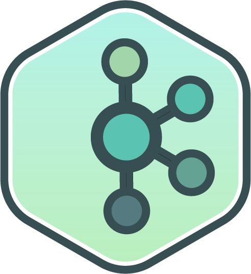

#  Hi there! I'm Jeferson Torres 👋
## Welcome to my GitHub
- 🔭 I'm currently looking for new challenges and opportunities.
- 🌱 I'm learning the technologies to become a reference among Developers.
- 💬 Ask me about Docker, Java and Git and I'll be happy to help.
- ⚡ Fun fact: I have an orange belt in Judo. I know a little about the guitar, recorder, clarinet and saxophone. And I like to play video games.

### How to reach me:

### Technologies I use in my day
<!--Link dos Icon https://devicon.dev/-->

<!-- 

  <link rel="stylesheet" href="https://cdn.jsdelivr.net/gh/devicons/devicon@v2.15.1/devicon.min.css">
  
  
  
  
  
  
  
  
  
  
  
  

 -->

  
  
  
  
  
  
  
  
  
  
  
  
  

<!--  -->

<!--  -->

<!-- ### Hi there 👋
## I'm Jeferson Torres -->
<!-- # Hi there! I'm Jeferson Torres 👋 -->
<!--
**JefersonT/JefersonT** is a ✨ _special_ ✨ repository because its `README.md` (this file) appears on your GitHub profile.

Here are some ideas to get you started:

- 🔭 I’m currently working on ...
- 🌱 I’m currently learning ...
- 👯 I’m looking to collaborate on ...
- 🤔 I’m looking for help with ...
- 💬 Ask me about ...
- 📫 How to reach me: ...
- 😄 Pronouns: ...
- ⚡ Fun fact: ...
-->
